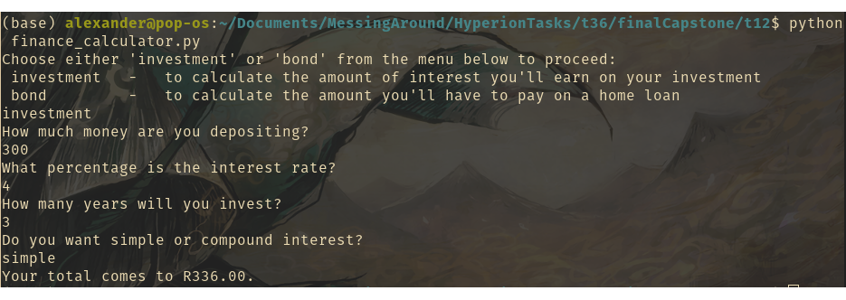

# Capstone Project: Variables and Control Structures

<a name ="description">
## Description
An application demonstrating the use of variables and control structures in the form of a simple finance calculator

<a name ="contents">
## Contents
*[Description](#description)

*[Installation](#installation)

*[Usage](#usage)

*[Credits](#credits)

<a name ="installation">
## Installation
Either download and unzip the archive or git clone the repo

<a name ="usage">
## Usage
Enter the command (from repo root)
> cd t12
> python finance_calculator.py

<a name ="credits"> 
## Credits
Alexander Rigler - Coding
HyperionDev - Providing the template
