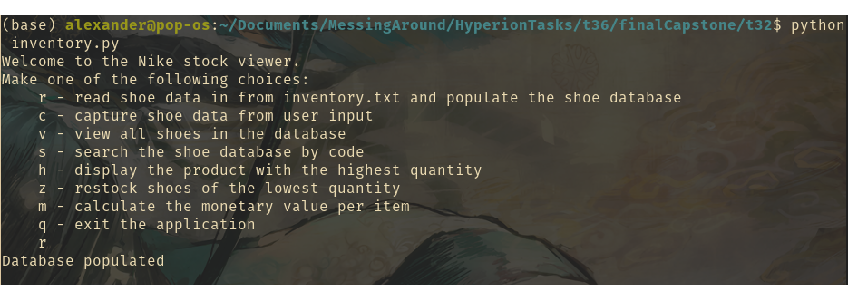

# Capstone Project: Object-Oriented Programming

<a name ="description">

## Description

An application demonstrating the use of classes and object orientation for quickly building up models of data.

<a name ="contents">

## Contents

[Description](#description)
[Installation](#installation)
[Usage](#usage)
[Credits](#credits)

<a name ="installation">

## Installation

Either download and unzip the archive or git clone the repo

<a name ="usage">

## Usage

Enter the command (from repo root)
> cd t32
> python inventory.py

<a name ="credits"> 

## Credits

Alexander Rigler - Coding
HyperionDev - Providing the template
